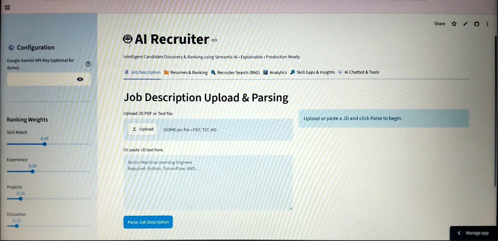

# AI Recruiter — Intelligent Candidate Discovery & Ranking

A production-quality AI-powered recruitment assistant that ranks candidates against job descriptions using semantic understanding, embeddings, and explainable AI.ss

## Live Demo
🔗 https://ai-recruiter-ewawqciumiktapyyt5gq3k.streamlit.app

## Demo Screenshot



## GitHub Repository
🔗 https://github.com/zorbathegreek985/ai-recruiter

### Features
- Resume Parsing
- Candidate Ranking
- Skill Gap Analysis
- Recruiter Search (RAG)
- AI Interview Question Generation
- Analytics Dashboard

## Project Goal
Build an intelligent system that:
- Parses resumes and JDs from PDFs/text
- Uses semantic matching (Gemini embeddings or TF-IDF fallback)
- Ranks candidates with weighted scoring
- Provides explainable decisions using Gemini
- Supports natural language recruiter search with RAG (FAISS)
- Analyzes skill gaps
- Interactive Streamlit dashboard with analytics

## Features Implemented
- **Resume Parser**: PDF parsing with PyMuPDF + pdfplumber, structured extraction with spaCy NER + rules
- **JD Parser**: Similar for job descriptions
- **Skill Extraction**: Predefined ontology + spaCy + Gemini for advanced
- **Semantic Matching**: Cosine similarity on embeddings (Gemini or TFIDF)
- **Candidate Ranking**: Weighted formula (Skill 45%, Exp 30%, Projects 15%, Edu 10%)
- **Explainable AI**: Gemini-generated explanations for rankings, strengths, weaknesses, missing skills
- **RAG Search**: Natural language queries using FAISS vector store + embeddings
- **Skill Gap Analysis**: Per candidate and aggregate
- **Analytics Dashboard**: Plotly visualizations (rank dist, skill freq, etc.)
- **Bonus**:
  - Resume Fraud Detection (basic: keyword stuffing detection, length anomalies)
  - Duplicate Resume Detection (simple name/email + semantic sim)
  - Interview Question Generator (Gemini)
  - LLM-based Recruiter Chatbot (basic in Streamlit with Gemini)

## Architecture
See architecture diagram below (text-based):

```
User (Recruiter)
    |
    v
Streamlit Dashboard (app.py)
    |
    +--> parsers/resume_parser.py  --> Extract structured resume JSON
    +--> parsers/jd_parser.py      --> Extract structured JD JSON
    |
    +--> embeddings/embedding_engine.py --> Generate embeddings (Gemini / TFIDF)
    |
    +--> ranking/ranking_engine.py --> Weighted scoring + ranking
    |
    +--> explainability/explanation_engine.py --> Gemini explanations
    |
    +--> rag/faiss_search.py --> Vector DB for semantic search
    |
    +--> dashboard/analytics.py --> Visualizations
    |
    v
    Skill Gap, Fraud, etc.
```

## Tech Stack
- Frontend: Streamlit + Plotly
- Parsing: PyMuPDF, pdfplumber, spaCy
- Embeddings: Google Gemini (text-embedding-004) or TF-IDF fallback
- Vector Search: FAISS
- LLM: Google Gemini (gemini-1.5-flash)
- Data: Pandas, NumPy, scikit-learn

## Setup & Run

1. Clone repo
2. `cd ai-recruiter`
3. `pip install -r requirements.txt`
4. Get Gemini API key from https://makersuite.google.com/app/apikey
5. Create `.env` : `GOOGLE_API_KEY=your_key_here`
6. `python -m spacy download en_core_web_sm` (if not done)
7. `streamlit run app.py`

## Sample Data
Included in `data/` : sample resumes and JD PDFs generated for demo.

## Folder Structure
See original spec.

## Bonus Features
All listed are partially or fully implemented in the dashboard.

## Future / Production
- Scale with ChromaDB or Pinecone instead of FAISS in-mem
- Fine-tune embedding model
- Add auth, multi-user, DB persistence (Postgres)
- Deploy to Streamlit Cloud / HuggingFace / AWS
- Add OCR for scanned resumes (easyocr or tesseract)

## Demo
Run locally and upload sample files from data/ or your own PDFs.

## Deployment to Streamlit Cloud (Recommended)

This app is ready for one-click deployment on Streamlit Cloud.

### Step-by-step Deployment

1. **Prepare your local copy** (or use this workspace):
   ```bash
   cd ai-recruiter
   ```

2. **Create a GitHub repository**
   - Go to https://github.com/new
   - Name it `ai-recruiter` (or your choice)
   - Make it **Public** (required for free Streamlit Cloud)
   - Do **not** initialize with README (we already have one)

3. **Push the code to GitHub**
   ```bash
   git init
   git add .
   git commit -m "Initial commit: AI Recruiter - Semantic Candidate Ranking"
   git branch -M main
   git remote add origin https://github.com/YOUR_USERNAME/ai-recruiter.git
   git push -u origin main
   ```

4. **Deploy on Streamlit Cloud**
   - Go to https://share.streamlit.io
   - Sign in with GitHub
   - Click **"New app"** → **"Deploy an app from GitHub repo"**
   - Select your repo `ai-recruiter`
   - Main file path: `app.py`
   - Click **Deploy**

5. **Configure Secrets (Important!)**
   - After the app starts (it may fail first time), go to the app page
   - Click the **three dots** (⋯) → **Settings** → **Secrets**
   - Paste this (replace with your real key):

   ```toml
   GOOGLE_API_KEY = "your_actual_gemini_api_key_here"
   ```

   - Click **Save**. The app will automatically restart.

6. **(One-time) The app will download the spaCy model** on first run via `setup.sh`. This is handled automatically on Streamlit Cloud.

### Local Testing Before Cloud Push

```bash
# Copy the example secrets
cp .streamlit/secrets.toml.example .streamlit/secrets.toml
# Edit .streamlit/secrets.toml and add your real key

streamlit run app.py
```

### Notes for Streamlit Cloud
- The app falls back gracefully to TF-IDF if no Gemini key is provided.
- All sample data is included in the repo (`data/` folder).
- Heavy dependencies (PyMuPDF, FAISS, spaCy) are supported.
- First build may take 3–6 minutes while installing packages and downloading the spaCy model.

## License
MIT for demo purposes.

## Contact
Built as part of AI project demo.
